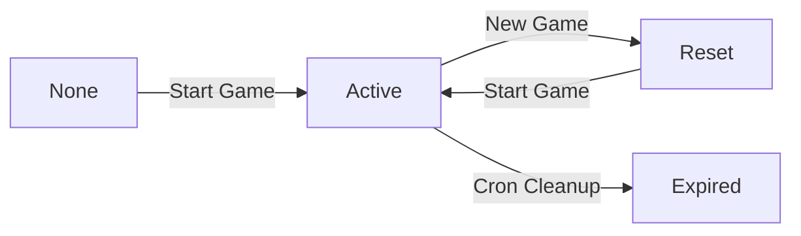
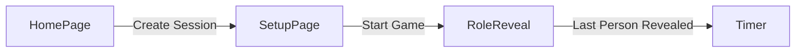

# Project Planning — Codeword

## 1. Overview
**What it is:**
- An interface/website for the "word imposter" game. Everyone in the group will be given a word except for one imposter who only gets a hint. Each person takes a turn saying a clue associated to the word in an attempt to convince the other players they aren't the imposter. The imposter will try to blend in and not get caught, while also trying to figure out the word.

**Who it's for:**
- A group of players/people that are physically present with one device to play this game.

**Why build it (goals):**
- Simplify the game setup by randomizing who the imposter is and curating word packs and hints for imposter

**Tech stack:**
- Frontend: React, TypeScript, Tailwind, shadcn/ui
- Backend: Express, TypeScript
- Database: PostgreSQL, Prisma
- Local dev: Docker Compose

## 2. Data Model
**Entities:**
- word_packs (id, name)
- words (id, text, word_pack_id)
- hints (id, text)
- word_hints (word_id, hint_id)
- sessions (id, word_pack_id, word_id, hint_id, imposter_index, expires_at)

**Relationships:**
- 1 word pack has MANY words (1:N)
- 1 word can have MANY hints, and 1 hint can belong to MANY words (many-to-many)

**In-Memory Data:**
This is data that doesn't need to be stored in a database
- Session
    - List of players
        - Name
        - Revealed (boolean)
    - Chosen word pack

## 3. Features / Flows
**Core flow (happy path, step by step):**
1. Click create session -> session creation form page
2. Add names, add/remove players, submit -> word pack selection page
3. Select word pack -> start game modal
4. Press start game -> role reveal page
5. Players press on their names -> revealed role/word/hint modal
6. Players press confirm and pass to next player -> role reveal page
7. Reveal page has no more players to reveal, shows "Start" button -> timer page
8. Timer runs out -> Display instructions to vote (in person) and "New Game" button
9. User presses "New Game" -> word pack selection page

**Secondary flows (setup, reset, edge entry points):**
- Add player: append new row on setup page
- Remove player: remove button per player row
- Reset: available during role reveal/timer, returns to word pack selection page (same destination as "New Game")

**Out of scope:**
- Timer length choice
- In-app voting
- Image/thumbnail for word packs
- Amount of imposters

## 4. API Contract
| Method | Path | Request | Response | Notes/constraints |
|--------|------|---------|----------|--------------------|
| GET | /api/word-packs | - | ``[ { id, name}, ... ]`` | List of wordpacks to display for user to choose from |
| POST | /api/start-game | ``{ wordPackId, playerCount }`` | ``{ sessionId }`` | Backend picks word, hint, and imposter index (0 to playerCount-1) |
| GET | /api/reveal/:sessionId/:playerIndex | - | ``{ word }`` or ``{ hint }`` | Returns ``word`` if not imposter, ``hint`` if imposter. Uses path params instead of query params because params are required. | 

## 5. Core Logic / Business Rules
- Imposter selection: backend randomizes index 0 to player count - 1

- Word/Hint selection: random word (word_id) from chosen word pack, random hint from the word_hints table from randomized word_id

- Session state: stored in DB not client to prevent checking response for chosen codeword or who imposter is -> will mean more DB reads during reveal since not stored locally
- Session creation: sessionId only created on "start game" (after setup)
- Session cleanup: CRON job to clean sessions after expiration
- Session time extension: Because session rows are reused, when a new game is made, ``expires_at`` field must be updated (+10 or +20 mins from current time)
- Session state holds word_id and hint_id instead of actual text for normalized schema -> will need to join tables to get actual text; trivially fast to search because of unique IDs, negligible overhead

- Reveal query: session stores ids, uses joins on ids to get actual text 
- Reveal: returns only word (non-imposter) or hint (imposter), but never both, never the full mapping

- Reset/New Game: same session row in database is reused, fields are nulled and re-randomized instead of making new row; reduces amount of rows to clean up with the tradeoff of recording history/past rounds

**State transitions:**
- Session Row Lifecycle: none -> active (Pressing "Start Game") -> reset (nulled fields, same row) -> expired (CRON job)

- Game screen transition: Home Page -> Create Game/Session Button -> Setup Page -> Start Game Button -> Role Reveal -> Last Person Revealed -> Timer

- Player revealed status changes from ``false`` to ``true`` after clicking their name and confirming with modal

**Edge cases:**
- 

## 6. Frontend Structure
**Screens/views:**
- 

**Navigation triggers:**
- 

**Local state vs. API-driven state:**
- 

**Reusable components:**
- 

## 7. Milestones
0. [ ] Project setup — init repo, React/TS frontend, Express/TS backend, Docker Compose for local Postgres, Prisma connected, verify test query works
1. [ ] Schema + seed data — word_packs, words, hints, word_hints; seed sample data
2. [ ] Word packs endpoint — GET /api/word-packs
3. [ ] Start-game endpoint — session table, randomization logic, upsert row, return sessionId
4. [ ] Reveal endpoint — GET /api/reveal/:sessionId/:playerIndex, scoped response
5. [ ] Setup screen (frontend) — add/remove players, word pack selection, SessionContext, no API calls yet
6. [ ] Wire start-game + reveal flow — setup to role reveal screen using real endpoints
7. [ ] Timer + reset/new game flow
8. [ ] Session cleanup — expires_at + cron job

## 8. Open Decisions
| Decision | Default (for now) | Revisit when |
|----------|--------------------|--------------|
|          |                    |              |